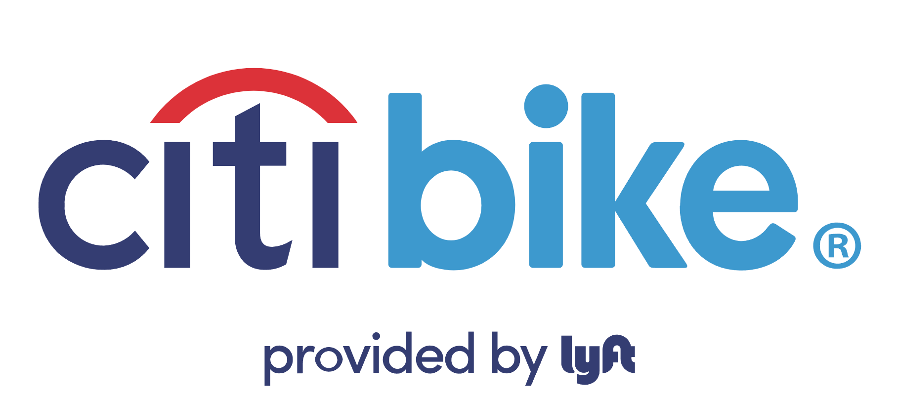
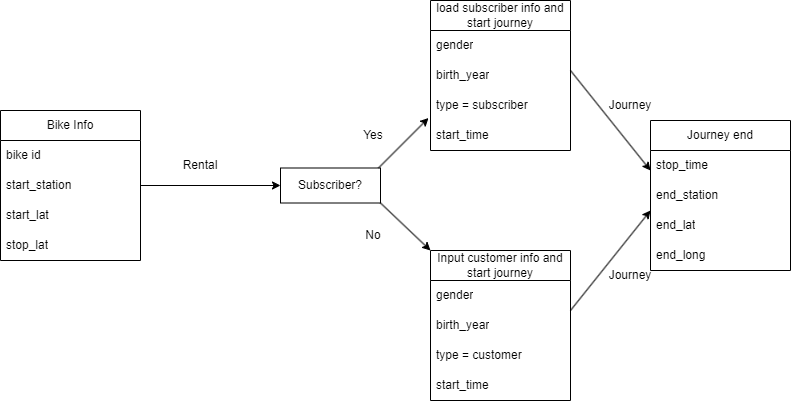
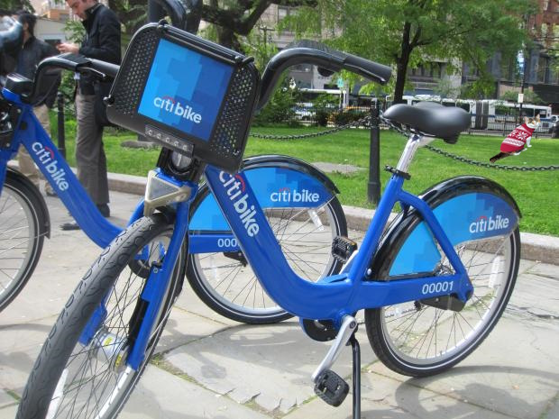

```{r, echo=FALSE, out.width = '40%'}

```

```{r, results = FALSE, message=FALSE, warning=FALSE}
library(tidyverse)
library(tsibble)
library(tsibbledata)
library(leaflet)

nyc_bikes <- tsibbledata::nyc_bikes
head(nyc_bikes)
```

```{r, results = FALSE, warning=FALSE}
# splitting start time and stop time into year, month, day, time
# Also combining start_day with month and year to create start_date, then doing the same to stop_day to create stop_date
# Not all of these values have been used in final reporting
nyc_bikes_ext <- nyc_bikes %>% 
  mutate(start_day = day(start_time),
         month = month(start_time, label = TRUE),
         year = year(start_time),
         weekday = wday(start_time, label = TRUE),
         start_date = make_date(year = year, month = month, day = start_day),
         stop_day = day(stop_time),
         stop_date = make_date(year = year, month = month, day = stop_day)) %>% 
# creating time_period column, then rounding to create duration_mins
  mutate(time_period = floor(as.period(stop_time - start_time, units = "minutes"))) %>% 
   mutate(duration_mins = round(as.numeric(time_period, "minutes"))) 

nyc_bikes_ext
```

Citi Bikes are a bike-rental service originating in New York City - For 10 years they have provided New Yorkers with an alternative way of
getting around *The Big Apple*, *The City That Never Sleeps*, or whatever your preferred name is.

Citi Bikes provide a year-round service, but how popular of a service is it?

In this data-set, we have 10 rental bikes which have two usage cases - The one-off customer rental, and the subscriber, 
who (presumably) use the service regularly.

Below is a simplified version of how this data was collected:

```{r, echo=FALSE, out.width = '100%'}

```

This is a good opportunity to address potential concerns with data privacy, as we are technically collecting data on the day-to-day movements of
subscribers or one-off customers. However, there is nothing in this data set that explicitly ties a person to their data (e.g no names, no id's).
All that is present is their gender and birth year, which is harder to tie to one person. As well as this, a persons movement is only visible as long
as they are with the bike - Once it is dropped off, they are invisible again.


### Warnings about the data-set

Perhaps the biggest flaw in this data-set is the limited sample size - Of the approximately 12 thousand bikes available, this sample only covers <span style="text-decoration:underline">**10**</span> 
bikes.
Additionally, we only have one year of data to look it. There is nothing to say that the conclusions we draw from this year will be similar to the year(s) before or after.

____________________________________________________________________________________________


## Looking at Rental data

First, let's take a look at how many rentals these 10 bikes had over the course of a month.
This will allow us to see an overall breakdown of usage before we look at *who* is using them.

```{r}
# rentals by month
nyc_bikes_ext %>% 
  index_by(month) %>% 
  count() %>% 
  ggplot(aes(x = month, y = n)) +
  geom_col(fill = "skyblue", colour = "darkblue") +
  geom_text(aes(label = n), size = 3, nudge_x = 0, nudge_y = 20) +
   labs(
    x = "Month",
    y = "Total Rentals",
    title = "Rental Breakdown by month",
    ) +
  theme_bw()
```

From this, we can clearly see that rentals spike in July and August, presumably due to improved weather conditions, 
while they fall off substantially in the winter.
However, we can see that even in the colder months, these bikes are rented over 100 times - Not too bad!

This also immediately highlights an area for improvement - If people do not want to cycle in the winter months, *why not?*

**Perhaps there is a case for making the bikes more winter ready:**
 <br/ >    > If the bikes are not sheltered from any poor weather conditions, people may not want to cycle on a wet bike!
 <br/ >    > Given worse road conditions, such as Ice, perhaps the bikes could have their tires replaced with Winter tires
 
 **Or perhaps a marketing push, focusing on Cycling Safety during Winter would help boost numbers.**
 **People might be less reluctant to cycle in the winter if they have more confidence in how to cycle safely.**
____________________________________________________________________________________________

**So now we can see the distribution of Rentals per month, but the main questions remains:**

_Who is renting them?_

## One-off customers vs Subscribers

```{r}
# type of trip
nyc_bikes_ext %>% 
  group_by(type) %>% 
  count(month) %>% 
  ggplot(aes(x = month, y = n, fill = type)) +
  geom_col(show.legend = FALSE)+
  geom_text(aes(label = n), size = 3, nudge_x = 0, nudge_y = 20)+
  facet_wrap(~type) +
  labs(
    x = "\n Month",
    y = "Total Rentals",
    title = "Rental Breakdown by month",
    subtitle = "Split by type of rental"
    
  ) +
  scale_colour_brewer(guide = "none") +
  scale_fill_manual(values = c(
    "Customer" = "skyblue",
    "Subscriber" = "darkblue"
  )) +
  theme_bw()+
  theme(axis.text.x = element_text(angle = 90, vjust = 1))
```

From this we can see, of the 10 bikes presented in this data set, that the vast majority of rentals are from subscribers.
This is the case across every month - 

```{r}
nyc_bikes_ext %>% 
  group_by(type) %>% 
  count(month) %>% 
  ggplot() +
  geom_bar(aes(x = month, y = n, fill = type), stat = "identity", position = "fill")+
 # geom_text(aes(label = n), size = 3, nudge_x = 0, nudge_y = 20)+
  #facet_wrap(~type) +
  labs(
    x = "\n Month",
    y = "Total Rentals",
    title = "Rental Breakdown by month",
    subtitle = "Proportion of rentals by type",
    fill = "Rental by:"
    ) +
  scale_fill_manual(values = c(
    "Customer" = "skyblue",
    "Subscriber" = "darkblue"
  )) +
  theme_bw()+
  theme(axis.text.x = element_text(angle = 90, vjust = 1))
```

The proportion of subscribers completely dominates one-off customers, even during summer, the typical holiday (or vacation - when in Rome) season.
This could suggest several things - Perhaps the price of one-off rental is off-putting to people who aren't already subscribed.
It may also suggest that there is not sufficient marketing towards one-off customers, or that it just isn't clear how to rent a bike without a subscription.

However, just from what is presented, there is nothing to suggest that these particular bikes might not be in a particularly attractive area to the 
one-off use demographic - If this demographic is dominated by tourists, for example, and these bikes are located in a business district, there might be 
less people who want to rent there as compared to a more tourist-friendly area.
____________________________________________________________________________________________

## Distribution 
  
 <font size="2"> *Below is a map that displays a random sample of 500 starting locations.
  <br /> This gives a good general impression of where exactly our use cases come from. 
  <br /> Keep in mind that the data-set only looks at <span style="text-decoration:underline">10</span>  bikes - So the results probably won't be that wide spread.* </font> 

<font size = "3"> Please click on a numbered circle to ungroup it <br /></font>
```{r}
# take 500 random samples of starting longitude/latitudes then use them to create a leaflet
long_lat <- as_tibble(nyc_bikes_ext) %>% 
  select(start_long, start_lat, type) 
  
 
long_lat_samples <- sample_n(long_lat, 500)

palette <- colorFactor(c("lightblue", "darkblue"), domain = c("Customer", "Subscriber")) 

nyc_bike_map <- long_lat_samples %>% 
  leaflet() %>% 
  addTiles() %>% 
  addCircleMarkers(lng = ~start_long,
             lat = ~start_lat,
             clusterOptions = markerClusterOptions(),
             label = ~type,
             fillColor = ~palette(type),
             fillOpacity = 1) %>% 
  addLegend('bottomright', pal = palette, values = long_lat_samples$type,
            title = 'Rental Type',
            opacity = 1)

nyc_bike_map
```

These bikes appear to all be centred in Jersey City - When compared to other areas of New York, it may not be the go-to spot for tourists.
It is also a large residential section of New York, which might explain why the proportion of subscribers is so much higher than one-off rentals,
as Subscribers may be using them in their day-to-day routine.

Having looked at several samples, One-off customers tend to cluster around areas like parks or green-spaces, which may suggest that one-off rentals 
tend to be for leisure, rather than practical reasons, such as cycling to or from work.


This also means that it may be harder to draw any specific conclusions from this sample - While the above may suggest that the vast majority of rentals come
from subscribers, how would this compare if we looked at an area like Manhattan, or an area that wasn't as residential?
 
________________________________________________________________________

## Conclusions

While it may be tempting to say with certainty that Bike rentals go down in Winter, and that Subscribers tend to use the Citi Bikes service more than one-off Customers,
we have only looked at a very small sample within a small area - Remember, New York city spans over 780km^2^ and has a population of 8.47 million (according to date from 2021).
To say that our small sample is true of the entire service would be premature - However, they give a good point to start looking.

With that out the way, the conclusions we can draw from this sample is that additional measures may need to be taken to ensure growth during winter months 
(e.g bike shelters, winter tires), and that one-off rentals are a market that are possibly not being targeted as well as they could be.

```{r, echo=FALSE,fig.cap = "Thanks for reading", out.width = '80%'}

```